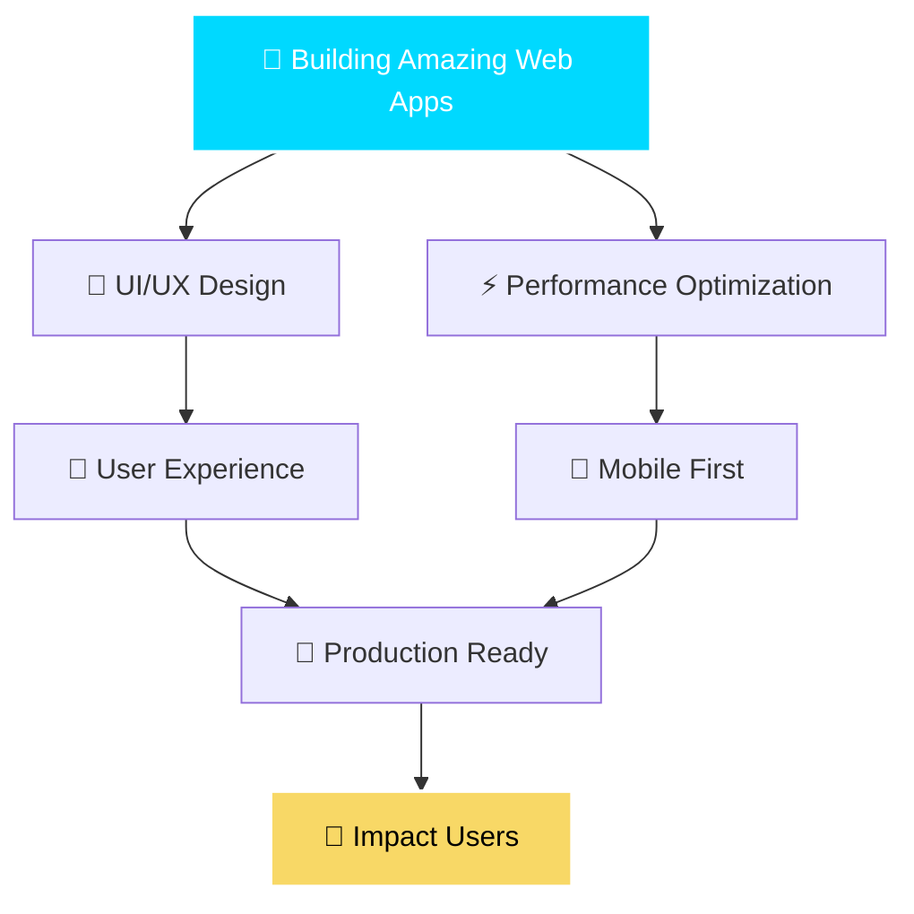

<div align="center">

# 🎨 Hi there, I'm Preetam 👋


</div>

<div align="center">


[](https://github.com/hacknotch)
[](https://github.com/hacknotch)

</div>

---

<div align="center">

## 🌟 Welcome to my Digital Universe! 🌟

*I'm a passionate frontend developer who transforms ideas into beautiful, responsive, and user-friendly web experiences that make the internet a better place!*


</div>

<div align="center">


[](https://github.com/hacknotch)
[](https://github.com/hacknotch)

</div>

---

<div align="center">

## 🌟 Welcome to my Digital Universe! 🌟

*I'm a passionate frontend developer who transforms ideas into beautiful, responsive, and user-friendly web experiences that make the internet a better place!*


</div>

---

<div align="center">

## _**About Me**_

```yaml
name: Preetam Kulkarni
located_in: India
current_job: Frontend Developer & UI/UX Designer
education: ["Computer Science", "Web Development"]
status: Professional Developer

fields_of_interests:
  - "Frontend Development"
  - "User Interface Design"
  - "User Experience"
  - "Web Performance"
  - "Mobile Development"
  
technical_background:
  - "React & Vue.js Development"
  - "Responsive Web Design"
  - "API Integration"
  - "Performance Optimization"
  - "Cross-Platform Development"

currently_learning: ["Next.js", "TypeScript", "Web3", "AI Integration"]
2025_goals: ["Build Amazing Products", "Contribute to Open Source", "Mentor Others"]
hobbies: ["Coding", "Design", "Gaming", "Music"]
```

</div>

---

<div align="center">

## 🛠️ My Tech Arsenal 🛠️


</div>

<div align="center">

### 🎨 Frontend Technologies

<table>
<tr>
<td align="center" width="200">

<br><b>JavaScript</b>
</td>
<td align="center" width="200">

<br><b>TypeScript</b>
</td>
<td align="center" width="200">

<br><b>React</b>
</td>
<td align="center" width="200">

<br><b>Vue.js</b>
</td>
</tr>
<tr>
<td align="center" width="200">

<br><b>Angular</b>
</td>
<td align="center" width="200">

<br><b>Next.js</b>
</td>
<td align="center" width="200">

<br><b>HTML5</b>
</td>
<td align="center" width="200">

<br><b>CSS3</b>
</td>
</tr>
</table>

### 🎨 Styling & UI

<table>
<tr>
<td align="center" width="200">

<br><b>SCSS</b>
</td>
<td align="center" width="200">

<br><b>Tailwind CSS</b>
</td>
<td align="center" width="200">

<br><b>Bootstrap</b>
</td>
<td align="center" width="200">

<br><b>Material-UI</b>
</td>
</tr>
</table>

### ⚙️ Backend & Database

<table>
<tr>
<td align="center" width="200">

<br><b>Node.js</b>
</td>
<td align="center" width="200">

<br><b>Python</b>
</td>
<td align="center" width="200">

<br><b>MongoDB</b>
</td>
<td align="center" width="200">

<br><b>PostgreSQL</b>
</td>
</tr>
</table>

### 🛠️ Development Tools

<table>
<tr>
<td align="center" width="200">

<br><b>Git</b>
</td>
<td align="center" width="200">

<br><b>GitHub</b>
</td>
<td align="center" width="200">

<br><b>VS Code</b>
</td>
<td align="center" width="200">

<br><b>Docker</b>
</td>
</tr>
</table>

</div>

<div align="center">


</div>

---

<div align="center">

## _**Development Breakdown**_

```
💻  I Spent My Time On

JavaScript    █████████████████▓░░░   68.2%
React         ████████▓░░░░░░░░░░░░   15.4%
TypeScript    ██████▓░░░░░░░░░░░░░░   10.1%
CSS/SCSS      ████▓░░░░░░░░░░░░░░░░    4.8%
Node.js       ██▓░░░░░░░░░░░░░░░░░░    1.5%

Editors:

VS Code       ████████████████▓░░░░░   85%
WebStorm      █████████▓░░░░░░░░░░░░   15%

Frameworks:

React         ████████████████▓░░░░░   70%
Vue.js        █████████▓░░░░░░░░░░░░   20%
Angular       ███▓░░░░░░░░░░░░░░░░░░   10%
```

</div>

---

<div align="center">

## 🎯 What I Do 🎯


</div>

<div align="center">

<table>
<tr>
<td align="center" width="300">

<br><b>🔧 Frontend Development</b>
<br><i>Building responsive and interactive web applications</i>
</td>
<td align="center" width="300">

<br><b>🎨 UI/UX Implementation</b>
<br><i>Converting designs into pixel-perfect interfaces</i>
</td>
<td align="center" width="300">

<br><b>⚡ Performance Optimization</b>
<br><i>Ensuring fast and smooth user experiences</i>
</td>
</tr>
<tr>
<td align="center" width="300">

<br><b>🔄 API Integration</b>
<br><i>Connecting frontend with backend services</i>
</td>
<td align="center" width="300">

<br><b>📱 Responsive Design</b>
<br><i>Creating mobile-first, cross-platform solutions</i>
</td>
<td align="center" width="300">

<br><b>🧪 Testing & Debugging</b>
<br><i>Writing tests and fixing bugs for robust applications</i>
</td>
</tr>
</table>

</div>

<div align="center">


</div>

---

<div align="center">

## _**Current Mission**_



</div>

---

<div align="center">

## 🚀 Current Focus

- 🌐 **Modern Web Technologies**: Exploring the latest in web development
- 🤖 **AI Integration**: Learning to integrate AI/ML features in web apps
- 📊 **Data Visualization**: Creating interactive charts and dashboards
- 🔐 **Security Best Practices**: Implementing secure coding practices
- 🎯 **User Experience**: Focusing on creating intuitive and accessible interfaces

---

<div align="center">

## 📈 My GitHub Journey 📈


</div>

<div align="center">


</div>

<div align="center">


</div>

---

<div align="center">

## _**Featured Projects**_

| **[E-Commerce Platform](https://github.com/hacknotch/ecommerce-platform)** | **[Portfolio Website](https://github.com/hacknotch/portfolio)** |
|:---:|:---:|
| **E-Commerce Platform** • Full Stack | **Portfolio Website** • Frontend |
| Modern e-commerce solution with React & Node.js | Personal portfolio with stunning animations |
| 🔧 **Key Features:** | 🔧 **Key Features:** |
| • User authentication & authorization | • Responsive design |
| • Product catalog & search | • Interactive animations |
| • Shopping cart & checkout | • Contact form integration |
| • Payment integration | • SEO optimized |
| • Admin dashboard | • Performance optimized |
| [](https://reactjs.org/) [](https://nodejs.org/) | [](https://reactjs.org/) [](https://www.typescriptlang.org/) |

| **[Task Management App](https://github.com/hacknotch/task-manager)** | **[Weather Dashboard](https://github.com/hacknotch/weather-dashboard)** |
|:---:|:---:|
| **Task Management App** • Full Stack | **Weather Dashboard** • Frontend |
| Collaborative task management with real-time updates | Beautiful weather app with location services |
| 🔧 **Key Features:** | 🔧 **Key Features:** |
| • Real-time collaboration | • Location-based weather |
| • Drag & drop interface | • 7-day forecast |
| • Team management | • Interactive maps |
| • File attachments | • Dark/Light theme |
| • Progress tracking | • PWA support |
| [](https://vuejs.org/) [](https://www.mongodb.com/) | [](https://developer.mozilla.org/en-US/docs/Web/JavaScript) [](https://developer.mozilla.org/en-US/docs/Web/CSS) |

</div>

---

<div align="center">

## 🏆 Achievements

- 🎓 **Education**: Computer Science/Engineering background
- 💼 **Professional Experience**: Frontend development in various projects
- 🏅 **Certifications**: [Add your relevant certifications]
- 🎯 **Projects**: Built multiple web applications and contributed to open source

---

## 🌟 Featured Projects

### 🎨 [Project Name 1]
- **Description**: A modern web application built with React and TypeScript
- **Tech Stack**: React, TypeScript, Tailwind CSS, Node.js
- **Features**: [Key features of your project]
- **Live Demo**: [Link to live demo]
- **Repository**: [Link to GitHub repo]

### 🚀 [Project Name 2]
- **Description**: A responsive dashboard with real-time data visualization
- **Tech Stack**: Vue.js, Chart.js, Express.js, MongoDB
- **Features**: [Key features of your project]
- **Live Demo**: [Link to live demo]
- **Repository**: [Link to GitHub repo]

---

## 📊 Contribution Graph


---

<div align="center">

## 🤝 Let's Connect! 🤝


*I'm always open to discussing new opportunities, interesting projects, or just having a chat about technology!*

</div>

<div align="center">

[](https://linkedin.com/in/preetam-kulkarni)
[](https://twitter.com/hacknotch)
[](https://preetamkulkarni.dev)
[](mailto:preetam@example.com)

</div>

<div align="center">


</div>

<div align="center">

### 💬 Let's Chat!


*Feel free to reach out if you want to collaborate on something amazing!*

</div>

---

<div align="center">

## _**Profile Analytics**_

  

</div>

---

<div align="center">

## 💡 Fun Facts

- 🎮 I love gaming and often draw inspiration from game UIs
- ☕ Coffee is my fuel for coding marathons
- 🌱 Always learning something new in the tech world
- 🎵 Music helps me focus while coding
- 🏃‍♂️ I believe in work-life balance and staying active

---

## 📝 Recent Blog Posts

- [Building Responsive Web Applications in 2024](https://your-blog.com/post1)
- [The Future of Frontend Development](https://your-blog.com/post2)
- [Optimizing React Performance](https://your-blog.com/post3)

---

## 🎯 Goals for 2024

- [ ] Master advanced React patterns and hooks
- [ ] Learn WebAssembly for performance-critical applications
- [ ] Contribute more to open-source projects
- [ ] Build a full-stack application with modern tech stack
- [ ] Write technical blog posts regularly
- [ ] Mentor junior developers

---

<div align="center">

## 💬 Quote

> **"Code is Poetry, Design is Art and I Am the Artist"**

*Let's build the future together, one pixel at a time!*

</div>

---

## 🏷️ Skills


---

## 📈 Profile Views


<div align="center">


</div>

<div align="center">

## 🎉 Thanks for Visiting! 🎉


*Thanks for visiting my profile! Feel free to explore my repositories and don't hesitate to reach out if you'd like to collaborate or just have a chat!* 😊

</div>

<div align="center">

### ⭐ Star some of my repositories if you find them interesting! ⭐


</div>

<div align="center">


---

### 🚀 Keep Coding, Keep Creating! 🚀


*Made with ❤️ by [Preetam Kulkarni](https://github.com/hacknotch)*

</div>
