<div align="center">


</div>

<div align="center">


</div>

<div align="center">

[](https://preetamkulkarni.dev)
[](https://linkedin.com/in/preetam-kulkarni)
[](mailto:preetam@example.com)
[](https://twitter.com/hacknotch)

</div>

---

<div align="center">

## 🎨 About Me


</div>

<div align="center">

```javascript
const preetam = {
    name: "Preetam Kulkarni",
    role: "Frontend Developer & UI/UX Designer",
    location: "India",
    passion: ["Web Development", "User Experience", "Problem Solving"],
    skills: {
        frontend: ["React", "Vue.js", "TypeScript", "JavaScript"],
        styling: ["CSS3", "Tailwind CSS"],
        tools: ["VS Code", "Git", "Figma", "Adobe XD", "Webpack", "n8n"],
        backend: ["Node.js", "Express.js", "MongoDB"],
        ai_ml_data_science: ["Python", "TensorFlow", "PyTorch", "Scikit Learn", "Pandas", "Numpy", "SciPy"]
    },
    currentlyLearning: ["Next.js", "Web3", "AI Integration", "Microservices"],
    funFact: "I turn coffee into code and ideas into reality! ☕ → 💻",
    goals: ["Build amazing products", "Contribute to open source", "Mentor others"]
};

console.log("Welcome to my digital space! 🚀");
```

</div>

---

<div align="center">

## 🛠️ Tech Stack & Tools


</div>

<div align="center">

### Frontend Technologies


### Styling & UI


### Backend & Database


### AI & Machine Learning


### Tools & Others


</div>

---

<div align="center">

## 📊 GitHub Analytics


</div>

<div align="center">


</div>

---

<div align="center">

## 🎯 What I Do


</div>

<div align="center">

<table>
<tr>
<td align="center" width="300">

<br><b>🎨 Frontend Development</b>
<br><i>Creating beautiful, responsive web applications</i>
</td>
<td align="center" width="300">

<br><b>🎭 UI/UX Design</b>
<br><i>Designing intuitive user experiences</i>
</td>
<td align="center" width="300">

<br><b>⚡ Performance Optimization</b>
<br><i>Making apps fast and efficient</i>
</td>
</tr>
<tr>
<td align="center" width="300">

<br><b>🔄 API Integration</b>
<br><i>Connecting frontend with backend</i>
</td>
<td align="center" width="300">

<br><b>📱 Mobile Development</b>
<br><i>Building cross-platform solutions</i>
</td>
<td align="center" width="300">

<br><b>🧪 Testing & Debugging</b>
<br><i>Ensuring quality and reliability</i>
</td>
</tr>
</table>

</div>

---

<div align="center">

## 🚀 Featured Projects


</div>

<div align="center">

### 🌟 E-Commerce Platform
**Modern e-commerce solution with React & Node.js**

[](https://ecommerce-demo.vercel.app)
[](https://github.com/hacknotch/ecommerce-platform)

**Features:** User authentication, product catalog, shopping cart, payment integration, admin dashboard

---

### 🎨 Portfolio Website
**Personal portfolio with stunning animations**

[](https://preetamkulkarni.dev)
[](https://github.com/hacknotch/portfolio)

**Features:** Responsive design, interactive animations, contact form, SEO optimized

---

### 📱 Task Management App
**Collaborative task management with real-time updates**

[](https://taskmanager-demo.vercel.app)
[](https://github.com/hacknotch/task-manager)

**Features:** Real-time collaboration, drag & drop interface, team management, file attachments

</div>

---

<div align="center">

## 🎯 Current Focus

```mermaid
graph LR
    A[🎯 Current Goals] --> B[🌐 Next.js Mastery]
    A --> C[🤖 AI Integration]
    A --> D[📱 Mobile Development]
    A --> E[🎨 Advanced UI/UX]
    
    B --> F[🚀 Production Ready]
    C --> F
    D --> F
    E --> F
    
    style A fill:#FF6B6B,stroke:#fff,stroke-width:2px,color:#fff
    style F fill:#4ECDC4,stroke:#fff,stroke-width:2px,color:#fff
```


</div>

<div align="center">



</div>

---

<div align="center">

## 📈 Development Activity


</div>

<div align="center">

```
💻  Weekly Development Breakdown

Monday    ████████████████████▓░░░   85%  Planning & Architecture
Tuesday   ████████████████████████   100%  Core Development
Wednesday ████████████████████▓░░░   80%  Feature Implementation
Thursday  █████████████████████▓░░   90%  Testing & Debugging
Friday    ████████████████████▓░░░   75%  Code Review & Deployment
Weekend   ████████████▓░░░░░░░░░░░   50%  Learning & Side Projects

Languages:
JavaScript    ████████████████████▓░░░   85%
TypeScript    ████████████████▓░░░░░░░   70%
Python        ████████████▓░░░░░░░░░░░   60%
CSS           ████████████▓░░░░░░░░░░░   60%
Node.js       ██████▓░░░░░░░░░░░░░░░░░   30%
```

</div>

---

<div align="center">

## 🏆 Achievements & Stats


</div>

<div align="center">


[](https://github.com/hacknotch)
[](https://github.com/hacknotch)
[](https://github.com/hacknotch)

</div>

---

<div align="center">

## 💡 Fun Facts About Me


</div>

<div align="center">

<table>
<tr>
<td align="center" width="300">
🎮 **Gaming Enthusiast**
<br><i>I love gaming and often draw inspiration from game UIs for my designs</i>
</td>
<td align="center" width="300">
☕ **Coffee Addict**
<br><i>Coffee is my fuel for coding marathons and late-night debugging sessions</i>
</td>
<td align="center" width="300">
🎵 **Music Lover**
<br><i>Music helps me focus while coding - from lo-fi to electronic beats</i>
</td>
</tr>
<tr>
<td align="center" width="300">
🌱 **Continuous Learner**
<br><i>Always learning something new in the ever-evolving tech world</i>
</td>
<td align="center" width="300">
🏃‍♂️ **Fitness Enthusiast**
<br><i>I believe in work-life balance and staying active for better productivity</i>
</td>
<td align="center" width="300">
🎨 **Creative Mind**
<br><i>I see code as art and every project as a canvas for creativity</i>
</td>
</tr>
</table>

</div>

---

<div align="center">

## 🤝 Let's Connect!


*I'm always open to discussing new opportunities, interesting projects, or just having a chat about technology!*

</div>

<div align="center">

[](https://linkedin.com/in/preetam-kulkarni)
[](https://twitter.com/hacknotch)
[](https://preetamkulkarni.dev)
[](mailto:preetam@example.com)

</div>

---

<div align="center">

## 🎉 Thanks for Visiting!


*Thanks for taking the time to visit my profile! Feel free to explore my repositories and don't hesitate to reach out if you'd like to collaborate or just have a chat!* 😊

</div>

<div align="center">

### ⭐ Star some of my repositories if you find them interesting! ⭐


</div>

---

<div align="center">


</div>

<div align="center">

### 🚀 Made with ❤️ by [Preetam Kulkarni](https://github.com/hacknotch)

*"Code is Poetry, Design is Art and I Am the Artist"*

</div>